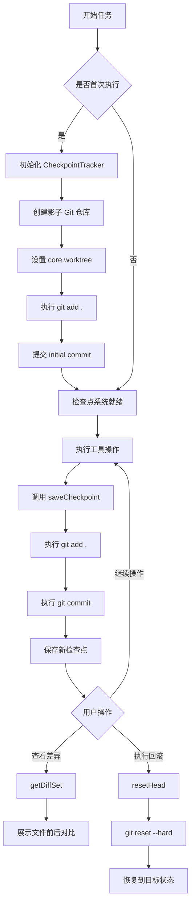

# Cline 检查点：用影子 Git 实现安全可靠的代码变更追踪

检查点（Checkpoint）是 Code Agent 中很重要的一项功能：

> 检查点 (Checkpoints) 功能会在任务执行的每个步骤后自动保存工作空间的快照。这个功能让你能够追踪代码变更、按需回滚，并放心地进行代码实验。

Cline 的 Checkpoint 设计的非常完善，Cline 会在每次使用工具（如文件编辑、执行命令等）后自动创建一个检查点，你可以随时查看与上一步之间的差异，也可以在不满意结果时一键回滚至上一步，甚至任意历史节点。

这样即使你启用了最宽松的“Auto Approve”模式，也可以放心让 AI 操作。否则，开发者将不得不在每一步都手动审查和确认，极大降低效率。


## Cline 的实现原理：基于影子 Git 仓库的版本控制

通过检查点可以对比差异、回滚操作，这些操作看起来十分 Git，而 Git 正是目前最成熟、最强大的版本管理工具。

Cline 巧妙地利用了这一点，通过构建一个独立于项目主 Git 仓库之外的“影子 Git 仓库”（Shadow Git Repository） 来实现检查点功能，既避免干扰用户的原始版本控制系统，又能完整复用 Git 的强大能力。

### Checkpoint 初始化 - 创建影子 Git 仓库

整个流程始于 Task 类（`src/core/task/index.ts`）中的的 `recursivelyMakeClineRequests` 方法内，当任务首次启动时，Cline 会尝试初始化 CheckpointTracker 实例：

这里设置了一个超时时间，如果初始化失败则提醒用户。

```ts
this.checkpointTracker = await pTimeout(
  CheckpointTracker.create(
    this.taskId,
    this.controller.context.globalStorageUri.fsPath,
    this.enableCheckpoints,
  ),
  {
    milliseconds: 15_000,
    message:
    "Checkpoints taking too long to initialize. Consider re-opening Cline in a project that uses git, or disabling checkpoints.",
  },
```

create 方法是检查点系统的入口：

1. 确认系统已安装 Git；
2. 获取当前工作目录并生成唯一哈希；
3. 创建 CheckpointTracker 实例；
4. 初始化影子 Git 仓库。

```ts
function create(
  taskId: string,
  globalStoragePath: string | undefined,
  enableCheckpointsSetting: boolean,
): Promise<CheckpointTracker | undefined> {  	
	// 确认 Git 命令是否安装
	await simpleGit().version()

  	// 获取工作目录
	const workingDir = await getWorkingDirectory()
	const cwdHash = hashWorkingDir(workingDir)
    
	// 实例化 CheckpointTracker
    // 此处初始化了 GitOperations 类，Git 相关的操作（add、commit、reset）都在这个类下
	const newTracker = new CheckpointTracker(globalStoragePath, taskId, workingDir, cwdHash)

	const gitPath = await getShadowGitPath(newTracker.globalStoragePath, newTracker.taskId, newTracker.cwdHash)
    // 重要：初始化影子 Git 仓库
	await newTracker.gitOperations.initShadowGit(gitPath, workingDir, taskId)

	return newTracker
}
```

其中，initShadowGit 是核心步骤，它完成了影子仓库的初始化，和我们初始化 Git 仓库没有差别：

```ts
const git = simpleGit(checkpointsDir)
await git.init()

// Configure repo with git settings
await git.addConfig("core.worktree", cwd)
await git.addConfig("commit.gpgSign", "false")
await git.addConfig("user.name", "Cline Checkpoint")
await git.addConfig("user.email", "checkpoint@cline.bot")

// Set up LFS patterns
const lfsPatterns = await getLfsPatterns(cwd)
await writeExcludesFile(gitPath, lfsPatterns)

// 执行一次 git add .
// 添加所有文件
const addFilesResult = await this.addCheckpointFiles(git)
if (!addFilesResult.success) {
  console.error("Failed to add at least one file(s) to checkpoints shadow git")
  throw new Error("Failed to add at least one file(s) to checkpoints shadow git")
}

// Initial commit only on first repo creation
await git.commit("initial commit", { "--allow-empty": null })
```

这里通过 core.worktree 配置，Git 的工作区指向用户项目目录，而 .git 目录则存放在 Cline 的全局存储中，实现了真正的“影子”结构。

> git config core.worktree 是 Git 中一个高级配置项，用于指定 Git 仓库的工作目录（工作树）的位置，它允许你将 .git 目录（版本控制信息）和实际的源代码目录（工作区）分离。

> Git 相关操作使用 Simple Git 这个库：https://github.com/steveukx/git-js。

### 创建 Checkpoint

影子仓库初始化完成后，Cline 就可以在每次工具调用后自动创建检查点。在初始化 `ToolExecutor`（工具执行类） 时传入 saveCheckpoint 方法，Cline 会在在每次使用工具时创建检查点。

```ts
this.toolExecutor = new ToolExecutor(
  // ....
  this.saveCheckpoint.bind(this),
  // ...
)
```

比如，在调用 `write_file` 工具后，调用 `saveCheckpoint` 方法创建检查点：

```ts
const commitHash = await this.checkpointTracker.commit()
```

本质是标准的 Git 提交流程：

```bash
git add .
git commit -m 'commit msg'
```

### 文件对比

文件对比位于 CheckpointTracker 类的 `getDiffSet` 方法，核心代码如下，代码注释里添加了 git 原生命令以及作用：

```ts
const git = simpleGit(path.dirname(gitPath))

// git diff --stat <diffRange>  显示两个提交之间变更的文件统计信息
// 包括：修改了哪些文件、增删行数等
const diffSummary = await git.diffSummary([diffRange])

// 遍历所有变更文件
const result = []
for (const file of diffSummary.files) {
  const filePath = file.file
  const absolutePath = path.join(this.cwd, filePath)

  // git show <commit-hash>:<file-path>
  // 显示 某个提交中指定文件的完整内容，查看旧版本的某个文件内容
  let beforeContent = await git.show([`${this.cleanCommitHash(lhsHash)}:${filePath}`])

  let afterContent = ""
  if (rhsHash) {
    // 获取另一个提交（如新版本）中该文件的内容
   afterContent = await git.show([`${this.cleanCommitHash(rhsHash)}:${filePath}`])
  } else {
    afterContent = await fs.readFile(absolutePath, "utf8")
  }

  result.push({
    relativePath: filePath,
    absolutePath,
    before: beforeContent,
    after: afterContent,
  })
```

有了这些信息，就可以在 VSCode 里展示文件的差异。

### 文件回滚

文件回滚位于 CheckpointTracker 类的 `resetHead` 方法：

```ts
const git = simpleGit(path.dirname(gitPath))
// git reset --hard [<commit>]
// 放弃当前代码
await git.reset(["--hard", this.cleanCommitHash(commitHash)])
```

## 总结

Cline 的 Checkpoint 功能之所以强大且可靠，关键在于它的设计哲学：不重复造轮子，而是站在巨人肩膀上。

通过引入“影子 Git 仓库”，Cline 成功将 Git 成熟的版本控制能力无缝集成到 AI 编程流程中。无论是细粒度的文件对比，还是原子化的状态回滚，都得益于 Git 经过数十年验证的稳定机制。

更重要的是，这种设计让用户可以在享受 AI 高效自动化的同时，始终保持对代码的完全掌控。即使 AI “走偏了”，也能一键还原，真正做到“大胆尝试，安全兜底”。

---

最后，我让 AI 生成了一张检查点逻辑的流程图：





